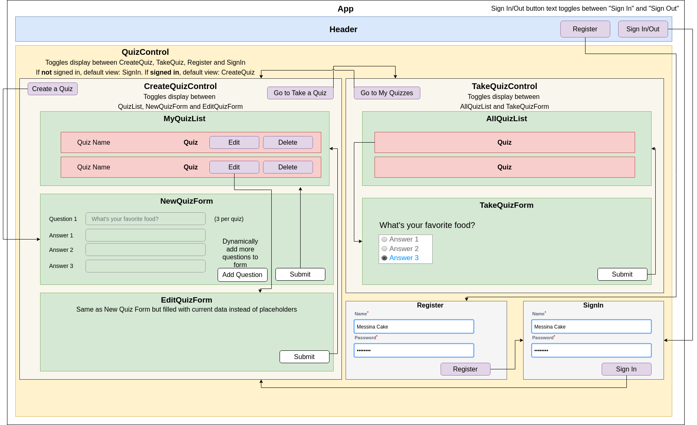

# _[Firebase Quiz](https://quiz-firebase-e2e5f.firebaseapp.com/)_

#### _Intro to Firebase, 05.04.2020 - 05.07.2020_

#### By _**Tiffany Siu, Adela Darmansyah, Rachel Schieferstein, Andriy Veremyeyev**_

---
## Table of Contents
1. [Description](#description)
    - [Component Diagram/Wireframe](#component-diagram/wireframe)
    - [Database Structure](#database-structure)
2. [Setup/Installation Requirements](#setup/installation-requirements)
    - [Requirements to Run](#requirements-to-run)
    - [Instructions](#instructions)
    - [Other Technologies Used](#other-technologies-used)
3. [Notable Features](#notable-features)
4. [Specifications](#specifications)
    - [User Stories](#user-stories)
    - [Further Exploration](#further-exploration)
5. [Screenshots](#screenshots)
6. [Test Case Example](#test-case-example)
7. [Known Bugs](#known-bugs)
8. [Support and Contact Details](#support-and-contact-details)
9. [License](#license)
---
## Description

This is an application that allows a user to complete a quiz or survey. Users should be able to create new quizzes or surveys while other users should have the ability to fill out those surveys.

This site has also been deployed [here](https://quiz-firebase-e2e5f.firebaseapp.com/).

### Component Diagram/Wireframe

### Database Structure

## Setup/Installation Requirements

### Requirements to Run
* _Web Browser_
* _Webpack_
* _Node.js_
* _NPM_

### Instructions

1. Download and install Node.js from the [official website](https://nodejs.org/en/download/)
2. Clone the [repository](https://github.com/ayohana/quiz-firebase.git) from my [GitHub page](https://github.com/ayohana/)
3. Use a command line/Bash to move to the project directory with `cd project-directory`
4. Run `npm install` to get all dependencies. 
5. Run `npm run start` to start up the program
6. Open [http://localhost:3000](http://localhost:3000) to view it in the browser.

Or simply go to this link: [Firebase Quiz](https://quiz-firebase-e2e5f.firebaseapp.com/)

## Other Technologies Used
* _HTML_
* _CSS_
* _Javascript_
* _React_
* _Redux_
* _Firebase_
* _Bootstrap 4.4.1_
* _ESLint_
* _Babel_
* _Jest_
* _Markdown_

## Notable Features
<!-- _features that make project stand out_ -->

## Specifications

<!-- 

  
Click to expand to view Specifications

| Specification | Input | Output |
| :-------------     | :------------- | :------------- |
| The program displays welcome message and menu with prices | Application start | Welcome message and menu displayed |
| The program displays special deals in readable format | Application start | Special deals displayed ("Buy 2, get 1 free" "3 for $5") |
| The program takes input of user that is not an integer, then assume 0 ordered | Bread="aaa", Pastry="" | Bread=0, Pastry=0 |
| The program takes number of loaves of bread and pastries and displays totals | Bread=4, Pastry=4 | Bread=$20, Pastry=$8, Total=$28 |
| If input qualifies for special deals, costs calculated using discounted price | Bread=3, Pastry=3 | Bread=$10, Pastry=$5, Total=$15 |

 -->

### User Stories

- [x] A user should be able to create, update and delete a survey.

- [x] All surveys should be stored in the database.

- [x] A user should be able to fill out and submit surveys.

- [x] Survey results should be submitted to the database.

- [x] A user should be able to sign up, sign in, and sign out.

- [x] A user should have their own dashboard which lists the surveys they've created.

### Further Exploration

- [x] As a developer, I want to deploy the application via Firebase.

- [ ] As a developer, I want to be able to dynamically add a new question when creating a new quiz.

- [ ] A user should be able to see the combined data on a survey in their dashboard. For instance, if a survey provides a 1-5 rating, return an average rating for all surveys.

- [ ] Try using a library like D3 to visualize data from surveys. This is only recommended if you have time to spare, interest in data visualization, and are doing a week-long project.

- [ ] Show responses to each of the user's created quizzes within the "my quizzes" section.

## Screenshots

<!-- _Here is a snippet of what the input looks like:_

_Here is a preview of what the output looks like:_

 -->

<!-- 

  
Expand to view More Screenshots 

  

 -->

<!-- _{Show pictures using , show what library does as concisely as possible but don't need to explain how project solves problem from `code`_ -->

## Test Case Example
_Tests are done through Jest and are run from the command line prompt with `npm test`._

<!-- _Some example tests:_

 -->

<!-- _describe and show how to run tests with `code` examples}_ -->

## Known Bugs

- [ ] Upon Editing a quiz, the previous values for questions and answers are not shown. The quiz fields update correctly though.

- [ ] On new account registration submission, the app automatically signs the user in. However, their displayName does not show up on their dashboard the first time they visit their dashboard. After signing out and in again, their name will show up on their dashboard.

- [ ] When not logged in "Go to My Quizzes" or "Take a quiz" opens a blank page

## Support and contact details

_If there are any question or concerns please contact us at our emails: [Tiffany Siu](mailto:tsiu88@gmail.com), [Adela Darmansyah](mailto:adela.yohana@gmail.com), [Rachel Schieferstein](mailto:violenza@gmail.com) and [Andriy Veremyeyev](mailto:belyybrat@gmail.com). Thank you._

### License

*This software is licensed under the MIT license*

Copyright (c) 2020 **_Tiffany Siu, Adela Darmansyah, Rachel Schieferstein, Andriy Veremyeyev_**
